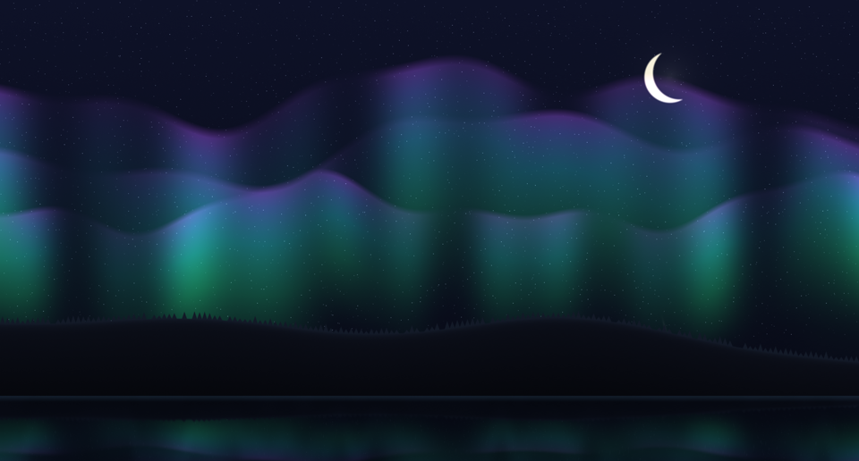
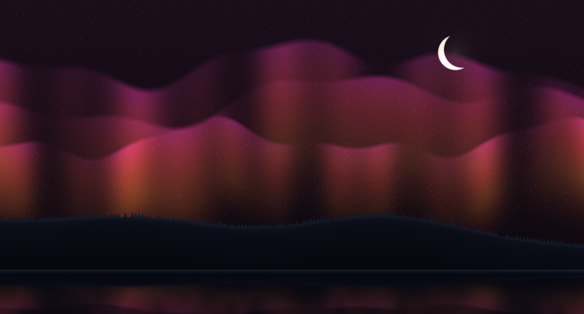
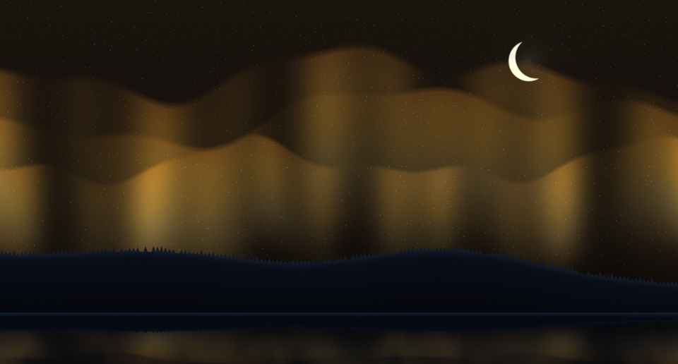
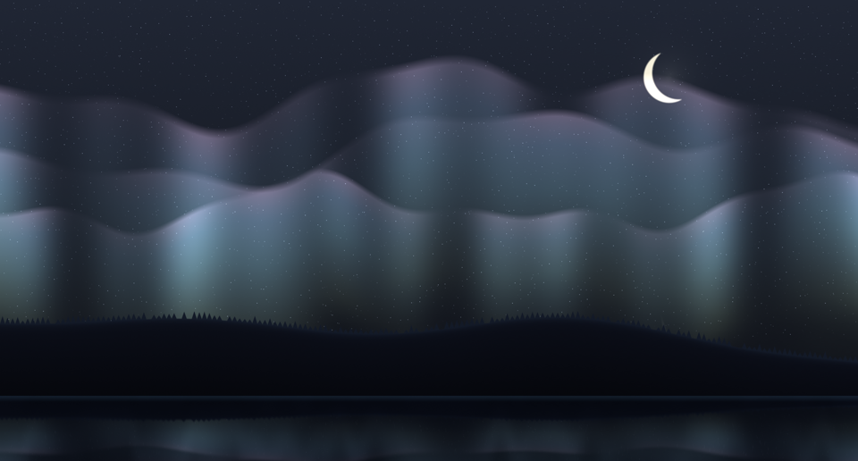
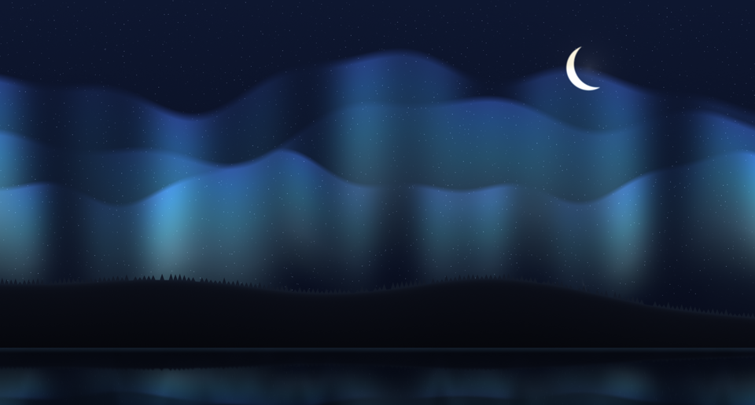

# Borealis

A summoned fullscreen aurora for Omarchy. 100% procedural, zero assets: one fragment
shader draws the curtains, the stars, the meteors, a crescent moon, a forested ridge,
and the water below. The math is ported from my own generative aurora engine.

Omarchy ships a terminal screensaver. Borealis is the scenery counterpart: a GPU shader
scene you summon when you step away.


## Install

```sh
omarchy plugin add https://github.com/marko-builds/borealis --enable
```

## Summon

Plugins cannot register keybinds, so bind one yourself in `~/.config/hypr/bindings.conf`:

```ini
bindd = SUPER ALT, B, Borealis, exec, omarchy-shell shell summon io.github.marko-builds.borealis
```

Any key or click dismisses it. While open it is deliberately modal, like a screensaver:
it holds keyboard and pointer until you dismiss it.

Optional: a row in the omarchy menu, in `~/.config/omarchy/extensions/omarchy-menu.jsonc`:

```jsonc
"borealis": { "icon": "󰖔", "label": "Borealis", "action": "omarchy-shell shell summon io.github.marko-builds.borealis" }
```

## Palettes

Five palettes: `aurora`, `ember`, `gold`, `nord`, `ice`.

| aurora | ember |
|---|---|
|  |  |

| gold | nord | ice |
|---|---|---|
|  |  |  |

Set `palette` on the plugin's entry in `~/.config/omarchy/shell.json`. It applies the
moment you save, even while the aurora is on screen:

```jsonc
"plugins": [
  { "id": "io.github.marko-builds.borealis", "palette": "nord" }
]
```

The entry is already there once the plugin is enabled; you only add the `palette` key.

## Lean by design

- Zero work while dismissed. The animation clock is gated on the overlay being open;
  dismissed, it sits at 0.0% CPU.
- Memory resident (`keepLoaded`), so summon is instant. That is the trade, stated.
- While open it draws about 3% CPU on my machine. The GPU does the painting.

## How it works

The scene is one GLSL fragment shader in a QML `ShaderEffect`, compiled with `qsb`.
Everything is an analytic field evaluated per pixel: the curtains and the sky port
straight from the source engine, while stars and meteors were reformulated from CPU
scatter ops into per pixel gathers (a hash starfield, distance to a moving streak
segment). Palettes arrive as six vec4 uniforms from QML, so switching one is a live
binding, not a shader rebuild.

`lookdev/index.html` is a browser twin of the shader for fast iteration: keys 1 to 5
switch palettes, `m`/`s`/`w`/`c` toggle extras, and `?t=120&freeze=1` pins the clock
for deterministic captures. The palette stills above come from it.

## License

MIT
