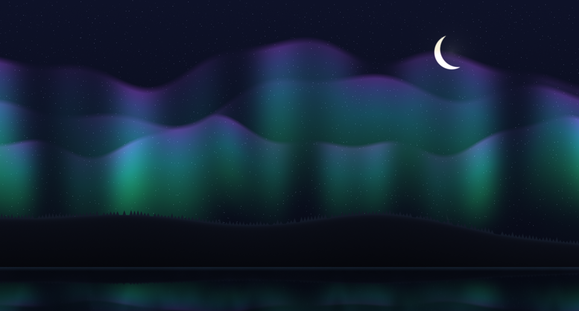
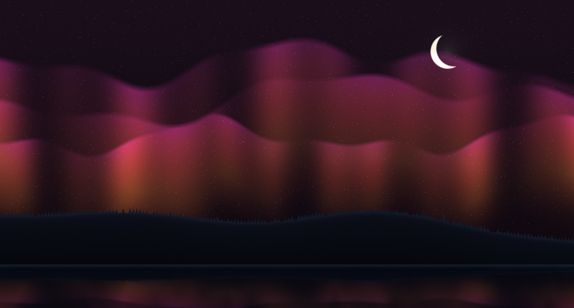
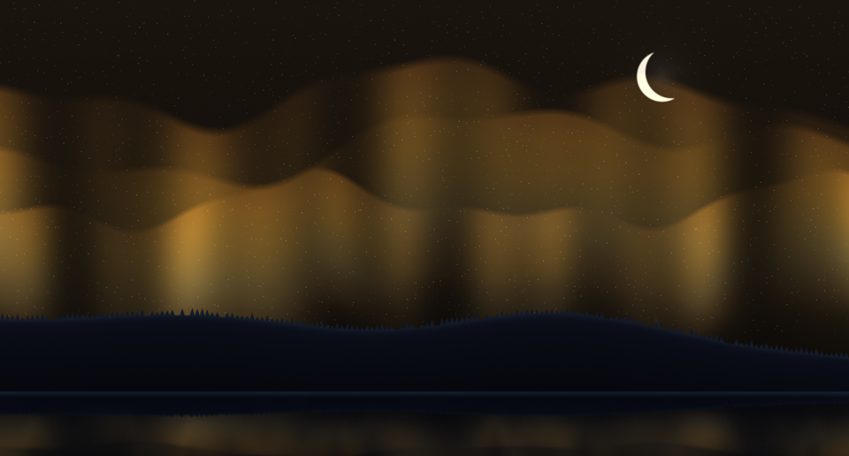
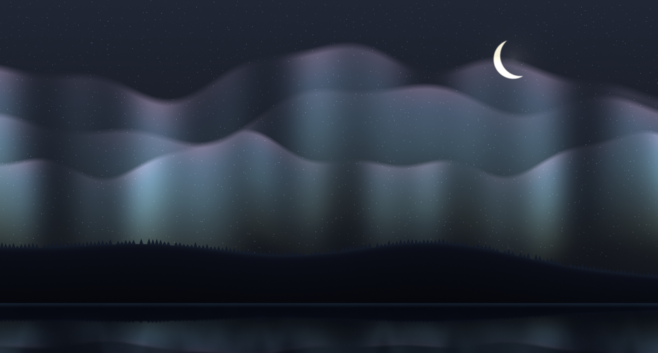
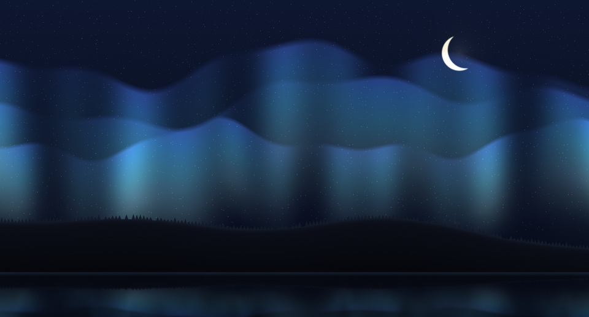

# Borealis

A summoned fullscreen aurora for Omarchy. One fragment shader draws the curtains, the
stars, the meteors, a crescent moon, a forested ridge, and the water below. The math is
ported from my own generative aurora engine. Since 0.2 it can play a synthesized aurora
pad under the scene, off by default: no recordings, one small ogg rendered from code.

Omarchy ships a terminal screensaver. Borealis is the scenery counterpart: a GPU shader
scene you summon when you step away.


## Install

```sh
omarchy plugin add https://github.com/marko-builds/borealis --enable
```

Remove it the same way:

```sh
omarchy plugin remove io.github.marko-builds.borealis
```

## Summon

Plugins cannot register keybinds, so bind one yourself in `~/.config/hypr/bindings.conf`:

```ini
bindd = SUPER ALT, B, Borealis, exec, omarchy-shell shell summon io.github.marko-builds.borealis
```

Any key or click dismisses it. While open it is deliberately modal, like a screensaver:
it holds keyboard and pointer until you dismiss it.

Optional: a row in the omarchy menu, in `~/.config/omarchy/extensions/omarchy-menu.jsonc`:

```jsonc
"borealis": { "icon": "󰖔", "label": "Borealis", "action": "omarchy-shell shell summon io.github.marko-builds.borealis" }
```

## Palettes

Five palettes: `aurora`, `ember`, `gold`, `nord`, `ice`.

| aurora | ember |
|---|---|
|  |  |

| gold | nord | ice |
|---|---|---|
|  |  |  |

Set `palette` on the plugin's entry in `~/.config/omarchy/shell.json`. It applies the
moment you save, even while the aurora is on screen:

```jsonc
"plugins": [
  { "id": "io.github.marko-builds.borealis", "palette": "nord" }
]
```

The entry is already there once the plugin is enabled; you only add the `palette` key.

## Aurora sound

Off by default. Borealis already had users when this landed, and an update should not
start making noise on its own. Turn it on with `ambience` on the same `shell.json` entry:

```jsonc
"plugins": [
  { "id": "io.github.marko-builds.borealis", "palette": "ember", "ambience": true, "ambienceVolume": 40 }
]
```

The pad fades in when you summon and ramps out when you dismiss. It loops without a
seam and sits at -14 LUFS, so it stays under whatever else is playing. `ambienceVolume`
is 0 to 100, default 40, and it sets the PipeWire stream level, so your mixer sees one
stream named after the plugin. Both keys apply live. Needs `mpv`, which Omarchy ships.

## Lean by design

- Zero work while dismissed. The animation clock is gated on the overlay being open;
  dismissed, it sits at 0.0% CPU.
- Memory resident (`keepLoaded`), so summon is instant. That is the trade, stated.
- While open it draws about 3% CPU on my machine. The GPU does the painting.
- No external dependencies beyond the stock Omarchy Quattro shell and its `mpv`.

## How it works

The scene is one GLSL fragment shader in a QML `ShaderEffect`, compiled with `qsb`.
Everything is an analytic field evaluated per pixel: the curtains and the sky port
straight from the source engine, while stars and meteors were reformulated from CPU
scatter ops into per pixel gathers (a hash starfield, distance to a moving streak
segment). Palettes arrive as six vec4 uniforms from QML, so switching one is a live
binding, not a shader rebuild.

`lookdev/index.html` is a browser twin of the shader for fast iteration: keys 1 to 5
switch palettes, `m`/`s`/`w`/`c` toggle extras, and `?t=120&freeze=1` pins the clock
for deterministic captures. The palette stills above come from it.

## Dev harness

`selftest.qml` summons the overlay beside the live shell and checks the whole contract:
the shader paints (a blank shader is the silent failure), the aurora moves, all five
palettes switch live while summoned, prototype keys in the config fall back to aurora, a
real key press dismisses, focus returns to the window that had it, a plain summon starts
no audio stream, `ambience: true` starts exactly one and dismiss removes it, and the
dismissed overlay sits at 0.0% CPU. `selftest.sh` wraps it with `omarchy plugin
validate`, `qmllint`, and an offline frame check, and refuses a verdict if the shell
restarted during the run.

```sh
./selftest.sh
```

Grabs and the log land under `$XDG_RUNTIME_DIR/borealis-selftest/`. Needs `wtype`.

## License

MIT
